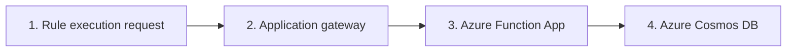

# Payment rules Azure Function application

## Application/System Architecture
The rules-engine consists of a Spring Boot application, deployed as an Azure Function app using `spring-cloud-function-adapter-azure`. 
Although the application is deployed to Azure, The service layer (which contains the engine itself) is kept separate from 
knowing about the Azure Function setup. To replace the Azure function app with a regular Spring Boot Webapp or an AWS Lambda, 
only this integration layer with the definition of the Azure function and some maven configuration needs to be changed.

Note: A downside to using Spring Boot is that it has a relatively long startup time. 

In the rules-engine its assumed that all data required to evaluate the rules is provided as input. 
I.e., if any new data is needed for a completely new rule, the endpoint needs to be provided that data as input. 

1. An HTTP request is sent from a client server towards the application gateway. The application gateway routes the request to
the correct backend.
2. Application gateway
3. The rules engine is deployed as an Azure function app (same principle as AWS Lambda). The reason for using this is due to its 
ease of configuration, scalability, and pricing model paying for usage only. 

## Local development

Need Azure Functions Core Tools to run and test the function locally. Local running will use the `local.settings.json` file.
https://learn.microsoft.com/en-us/azure/azure-functions/functions-run-local?tabs=macos%2Cisolated-process%2Cnode-v4%2Cpython-v2%2Chttp-trigger%2Ccontainer-apps&pivots=programming-language-java
On macOS:

`
brew tap azure/functions
`

`
brew install azure-functions-core-tools@4
`

`
mvn package
`

`
mvn azure-functions:run
`

Will run the function on your localhost on port 7071.

## Infrastructure
Created in Azure.

1. Manual: Create a new subscription.
2. Manual: Create the Azure Function in the consumption tier - could and should be automated.
3. Create the Azure Cosmos DB in the free tier - could and should be automated.
4. Configure network access so the function can access the cosmos DB.
5. Automatic: Commits to main builds and deploys code to the Azure function.

In the GitHub actions pipeline, a secret has to be added so we can login to deploy the function:
https://learn.microsoft.com/en-us/azure/developer/github/connect-from-azure?tabs=azure-cli%2Clinux

The pipeline is using the "Use the Azure login action with a service principal secret" approach, and setting
the AZURE_CREDENTIALS secret to allow auth for deployment. The secret is obtained from:
az ad sp create-for-rbac --name "myApp" --role contributor \
--scopes /subscriptions/{{subId}}/resourceGroups/test-group-dev  \
--json-auth

The cosmos DB key also has to be manually configured (note, there are better options than key).