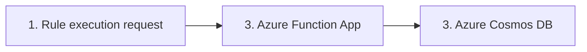

# Payment rules Azure Function application

## Implemented Functions
The application with its HTTP API is deployed to https://payment-rules-fapp-preprod.azurewebsites.net. No API key or any other form of auth
is required (just for ease of testing, in prod of course there would be some kind of auth). Access from all public IPs is allowed. 
To see the URLs of all the functions: 

There are two "categories" of functions in the application.
1. Rule configuration administration and viewing. 
2. Rule execution. 

## Application/System Architecture
The rules-engine consists of a Spring Boot application, deployed as an Azure Function app using `spring-cloud-function-adapter-azure`. 
Although the application is deployed to Azure, The service layer (which contains the engine itself) is kept separate from 
knowing about the Azure Function setup. To replace the Azure function app with a regular Spring Boot Webapp or an AWS Lambda, 
only the integration layer with the definition of the Azure function and some maven configuration needs to be changed.
In addition, the database layer (in its own package) can also easily be changed. 

Note: A downside to using Spring Boot is that it has a relatively long startup time, so other options could be considered.

In the rules-engine its assumed that all data required to evaluate the rules is provided as input. 
I.e., if any new data is needed for a completely new rule, the endpoint needs to be provided that data as input. 

1. An HTTP request is sent from a client server towards the Azure function.
2. The rules engine is deployed as an Azure function app (same principle as AWS Lambda). The reason for using this is due to its 
ease of configuration, scalability, and pricing model paying for usage only. 
3. An Azure Cosmos DB is used in the rules engine to fetch the most recent configuration data as well as allowing seeing all configurations, adding new configurations and seeing the schema for configurations.

## Local development

Need Azure Functions Core Tools to run and test the function locally.
Local running will use the `local.settings.json` file. More info [here](https://learn.microsoft.com/en-us/azure/azure-functions/functions-run-local?tabs=macos%2Cisolated-process%2Cnode-v4%2Cpython-v2%2Chttp-trigger%2Ccontainer-apps&pivots=programming-language-java).
Note: To test towards the Cosmos DB locally, the Key of the DB has to be obtained and set in the `application.yaml` file (replaced with "notUsedSetInGithubSecrets").
On macOS:

`
brew tap azure/functions
`

`
brew install azure-functions-core-tools@4
`

`
mvn package
`

`
mvn azure-functions:run
`
 Will run the function on your localhost on port 7071.

### Application tests
Not emulating the Cosmos DB as I have a M3 Mac and it's not possible to use the Emulator to
use a test container or docker image without a Windows VM...
https://learn.microsoft.com/en-us/azure/cosmos-db/emulator?tabs=sql-api%2Cssl-netstd21#run-the-linux-emulator-on-macos 

## Infrastructure
Created in Azure.

1. Manual: Create a new subscription.
2. Automated: Create the Azure Function in the consumption tier
3. Manual: Create the Azure Cosmos DB in the free tier - could and should be automated.
4. Manual: Configure network access so the function can access the cosmos DB.
Note: Due to the afunc being in the consumption plan, the entire datacenters outbound range has to be whitelisted (see more on this [here](https://learn.microsoft.com/en-gb/azure/azure-functions/ip-addresses?tabs=portal#find-outbound-ip-addresses))
5. Automatic: Commits to main builds and deploys code to the Azure function (takes around 2 mins).

### Manual steps in GitHub actions:

In the GitHub actions pipeline, a secret has to be added so we can login to deploy the function:
https://learn.microsoft.com/en-us/azure/developer/github/connect-from-azure?tabs=azure-cli%2Clinux

The pipeline is using the "Use the Azure login action with a service principal secret" approach, and setting
the AZURE_CREDENTIALS secret to allow auth for deployment. The secret is obtained from:
az ad sp create-for-rbac --name "githubActionApp" --role contributor \
--scopes /subscriptions/{{subId}}/resourceGroups/test-group-dev  \
--json-auth

The service principal needs to have role "Contributor" on the subscription level. 

The cosmos DB key also has to be manually configured (note, there are better options than key), 
so it's set as as a secret, COSMOS_DB_KEY, which is just one of the keys to access the DB. 