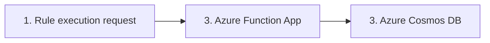

# Payment rules Azure Function application

## Implemented Functions
The application with its HTTP API is deployed to https://payment-rules-fapp-preprod.azurewebsites.net/api. No API key or any other form of auth
is required (just for ease of testing, in prod of course there would be some kind of auth). Access from all public IPs is allowed. 

Contact can be seen here: https://app.swaggerhub.com/apis-docs/SOLFRIDHAGENJOHANSEN/PaymentsAPI/1.0.0 
which is the same as the "api-contract.yaml" file (should be improved, some missing validations)

There are two "categories" of functions in the application.
1. Rule configuration administration and viewing (payments/configurations)
2. Rule execution (payments/rules)

All implemented APIs are

1. POST payments/rules - Executes rules based on the provided input. The configuration is obtained from a database, where the most recently created
config for that rule is selected. The config is cached in-memory for performance reasons, so there can be some delay after updating (just for ease when implementing,
have some notes on how this could be improved). 
Rules without any specified configuration are ignored when running, this is to allow for the code for any completely new rule to be deployed and then configured at a later time.
Rules can also be inactivated based on config, it is as if the rule does not exist. 
2. GET payments/rules - Returns all the rules that are implemented with the configuration (if any). If no configuration exists for the rule, only the rule id is returned.
3. GET payments/configurations - Returns the schema for configurations of all rules on a JSON format. Not the most readable with the current implementation, but it is enough to in principle
be able to do the initial configuration for a new rule based on the schema and not needing to see the code implementation.
4. POST payments/configurations - Create a new configuration for a rule. Note, I chose to not allow a PUT/PATCH for ease of implementation and allow keeping a history
of configurations (probably useful for e.g., auditing), so all fields have to be entered even if one was changed. This is set-up so that 
if the input rule specific configuration does not follow the format of the configuration as defined in the rule, it will fail with a "Bad Request". 
There are also validations of the input fields, so if the schema is correct, it will fail and give some nice information about the validation failures.
For the one rule with acquirer probability there is a custom validator on the rule that is used to validate the config here. This is
mostly to showcase that the concepts are generic.

### How this is done in the code
I have used reflection and abstract classes to make this as generic as I could figure out. Although reflections can make the code
slower the performance seems to be good (it would be interesting to see the performance if there are e.g, 300+ rules, but at that stage one would probably
split this up a lot more and e.g. have "chained" Azure Functions).

The main idea is that there is one abstract rule "AbstractRule" which does the common logic, and the specifics are implemented in the
abstract methods. This really makes it quite generic, and even running the rule (assumed rule order does not matter, if that does, this has to be changed)
is all done by using reflection to identify all the AbstractRule extending classes. Some of the common logic is e.g. fetching the config from the data layer,
mapping the config data to the correct structure (based on the config structure as it is defined in the rule), handling missing config, inactive rules,
and setting data about the rule execution. 

With the setup, if no new input and/or output data is required (which is likely will be required... Some improvements could be done here) the only change needed to 
1. Create a new rule.
2. Return the info about the new rule in the API
3. Return info about config schema
4. Set and update config schema

is to **create a new class extending the AbstractRule** (and adding one new enum with ID). So this means that there is e.g. no manual steps to allow updating the schema, it just works.

## System Architecture
The rules-engine consists of a Spring Boot application, deployed as an Azure Function app using `spring-cloud-function-adapter-azure`. 
Although the application is deployed to Azure, The service layer (which contains the engine itself) is kept separate from 
knowing about the Azure Function setup. To replace the Azure function app with a regular Spring Boot Webapp or an AWS Lambda, 
only the integration layer with the definition of the Azure function and some maven configuration needs to be changed.
In addition, the database layer (in its own package) can also easily be changed. 

In the rules-engine its assumed that all data required to evaluate the rules is provided as input. 
I.e., if any new data is needed for a completely new rule, the endpoint needs to be provided that data as input. 

1. An HTTP request is sent from a client server towards the Azure function.
2. The rules engine is deployed as an Azure function app (same principle as AWS Lambda). The reason for using this is due to its 
ease of configuration, scalability, and pricing model paying for usage only. 
3. An Azure Cosmos DB is used in the rules engine to fetch the most recent configuration
data as well as allowing seeing all configurations, adding new configurations and seeing the schema for configurations.
I chose Cosmos DB because it's a document store which made sense here since the configs will vary, and there is no need for relational data (as of now).
Cosmos DB is also very scalable, so seems to be a good option. 
Other than it being a document store I wanted to try something somewhat new, and Azure seems to be really pushing for this Cosmos DB solution.
It should be noted that I do regret it, because I use a Mac with an M3 processor, and there is no emulator for the Cosmos DB,
so creating integration tests in the code is not easily possible for me. 

The Azure function in the Consumption plan has cold-starts, not ideal, so for prod use here I would go for at least
the Premium plan as that does not have cold-starts and allows VNet integration. So both improves the initial response time
and improves security (probably needed considering this is payment data, could contain sensitive information).
I estimated (can give more specifics on where this is from) around 5 requests per. second,
and the system as it is now should be able to handle that. The function is on auto-scale, so if more instances are needed it will scale up.
I deployed this to Norway east, and depending on if all servers calling this method is from physically around here it may be sufficient
with only one region (in prod at least one DR region would likely be required).

## Local development

Need Azure Functions Core Tools to run and test the function locally.
Local running will use the `local.settings.json` file. More info [here](https://learn.microsoft.com/en-us/azure/azure-functions/functions-run-local?tabs=macos%2Cisolated-process%2Cnode-v4%2Cpython-v2%2Chttp-trigger%2Ccontainer-apps&pivots=programming-language-java).
Note: To test towards the Cosmos DB locally, the Key of the DB has to be obtained and set in the `application.yaml` file (replaced with "notUsedSetInGithubSecrets").
On macOS:

`
brew tap azure/functions
`

`
brew install azure-functions-core-tools@4
`

`
mvn package
`

`
mvn azure-functions:run
`
 Will run the function on your localhost on port 7071.

### Application tests
Not emulating the Cosmos DB as I have a M3 Mac and it's not possible to use the Emulator to
use a test container or docker image without a Windows VM...
https://learn.microsoft.com/en-us/azure/cosmos-db/emulator?tabs=sql-api%2Cssl-netstd21#run-the-linux-emulator-on-macos 

Therefore, there are no tests that integrate with the database, I mock that away. There are also
no test of running the actual function and then calling it to verify its working, although that would
probably be possible using e.g. RestAssured. 

The main part of the service-logic is tested in "integration"-test (mostly integration but with the exception of DB).

## Pipeline & Azure Infrastructure Setup
All infra is in Azure. 

1. Manual: Create a new subscription.
2. Automated: Create the Azure Function in the consumption tier. See the .github/workflows/infra-deploy.yaml pipe. Triggered by either changes to the bicep or manually.
3. Manual: Create the Azure Cosmos DB in the free tier - could and should be automated (probably easy, just add to Bicep)
4. Manual: Configure network access so the function can access the cosmos DB. Just set that the cosmos DB is open for entire datacenter outbound ranges.
Note: Due to the afunc being in the consumption plan, the entire datacenters outbound range has to be whitelisted (see more on this [here](https://learn.microsoft.com/en-gb/azure/azure-functions/ip-addresses?tabs=portal#find-outbound-ip-addresses))
In a prod setting this is not acceptable most likely.
5. Automatic: Commits to main builds and deploys code to the Azure function (takes around 2 mins). See the .github/workflows/deploy.yaml pipe, deploys on commits to main.

### Manual steps in GitHub actions:

In the GitHub actions pipeline, a secret has to be added so we can login to deploy the function:
https://learn.microsoft.com/en-us/azure/developer/github/connect-from-azure?tabs=azure-cli%2Clinux

The pipeline is using the "Use the Azure login action with a service principal secret" approach, and setting
the AZURE_CREDENTIALS secret to allow auth for deployment. The secret is obtained from:
az ad sp create-for-rbac --name "githubActionApp" --role contributor \
--scopes /subscriptions/{{subId}}/resourceGroups/test-group-dev  \
--json-auth

The service principal needs to have role "Contributor" on the subscription level. 

The cosmos DB key also has to be manually configured (note, there are better options than key), 
so it's set as as a secret, COSMOS_DB_KEY, which is just one of the keys to access the DB. 